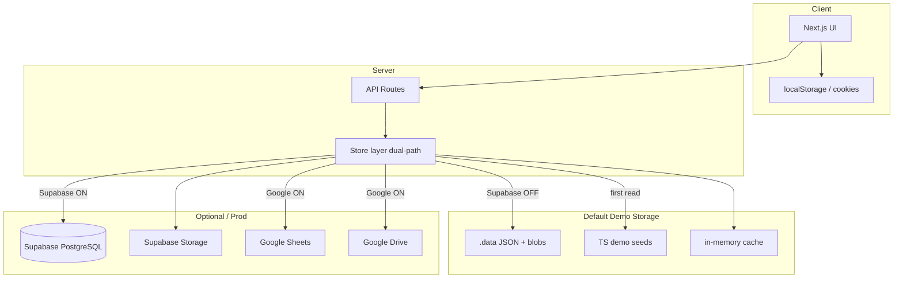
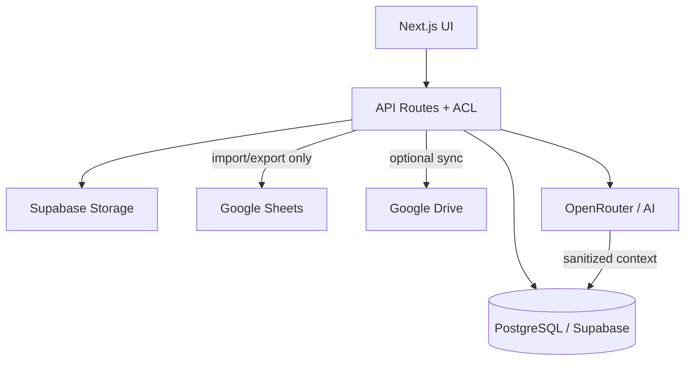

# SPIORA Data Flow Map

**Дата:** 15 июля 2026  
**Назначение:** потоки данных для ключевых сценариев (текущий путь, demo fallback, production path, внешние сервисы, точки утечки).

---

## Условные обозначения

| Символ | Значение |
|--------|----------|
| `[D]` | Demo mode (`SPIORA_DEMO_MODE=true`) |
| `[S]` | Supabase enabled (`isSupabaseConfigured()`) |
| `[G]` | Google integrations enabled |
| `.data` | Локальные JSON/файлы под `process.cwd()/.data/` |
| `503` | API возвращает «feature requires Supabase» |

---

## 1. Создание клиента

### Текущий путь (Lead Review → CRM)

```
UI (Lead Review / CRM)
  → POST /api/crm/clients (или lead sync)
    → auth: session cookie JWT
    → [G] google-sheets/service.ts
         → Google Sheets API append (CRM_WRITE range)
    → [!G][D] demo-data.ts (in-memory, без persistence)
    → [!G][!D] ошибка / пустой список
  → GET /api/crm/clients
    → [G] Sheets read + cache (TTL)
    → [D] DEMO_CLIENTS из demo-data.ts
  → UI отображает список
```

**Demo fallback:** статические клиенты из `demo-data.ts`; заметки в `demoNotesExtra[]` (in-memory).

**Production path (целевой):** `POST → clients table (Postgres) → RLS by org`.

**Внешние сервисы:** Google Sheets API, Google SA credentials.

**Точки утечки:**
- PII (имя, email, телефон, статус) в Google Spreadsheet;
- кэш Sheets в server memory;
- логи API при ошибках append;
- demo clients без шифрования at rest.

---

## 2. Создание задачи

```
UI (Tasks page)
  → POST /api/tasks
    → auth middleware
    → tasks/store.ts
      → [S] tasks-repo.ts → INSERT tasks (Supabase)
      → [!S] read .data/tasks.json
           → если пусто: seed из demo-tasks.ts → write .data
           → append task → write .data/tasks.json
    → attachments: task-attachments bucket [S] или .data/task-attachments/
  → GET /api/tasks
    → [S] SELECT * FROM tasks
    → [!S] read .data/tasks.json
  → UI render
```

**Demo fallback:** `demo-tasks.ts` → первый read инициализирует `.data/tasks.json`.

**Production path:** Supabase `tasks` + Storage `task-attachments`.

**На Vercel без [S]:** запись в `.data` **теряется** при redeploy / не видна другим инстансам.

**Точки утечки:** вложения на ephemeral disk; service role bypass RLS.

---

## 3. Создание события календаря

```
UI (Calendar)
  → POST /api/calendar/events
    → calendar/store.ts
      → [S] calendar-events-repo.ts
      → [!S] .data/calendar-events.json (+ demo-events.ts seed)
  → participants (optional)
    → [S] calendar-event-participants-repo.ts
    → [!S] .data/calendar-event-participants.json
  → reminders / guest invites / recordings
    → guest invites, audit, recordings → [S] ONLY → 503 без Supabase
  → GET /api/calendar/events → symmetric read
  → UI + localStorage calendar:layers (client-only prefs)
```

**Demo fallback:** `demo-events.ts`.

**Production path:** `calendar_events` + related tables.

**Точки утечки:** meeting guest tokens в Postgres без RLS; localStorage не содержит PII событий (только UI layers).

---

## 4. Отправка сообщения в Team Chat

```
UI (Team Chat)
  → POST /api/team-chat/messages
    → rate limit (in-memory, demo)
    → team-chat/store.ts
      → [S] team-chat-messages-repo.ts + Storage buckets
      → [!S] .data/team-chat-messages.json
           → seed demo-messages.ts при первом read
    → media upload → team-chat-{audio,images,files} [S] или .data dirs
  → GET /api/team-chat/messages
  → last_seen update → team_chat_last_seen [S] / .data
  → UI polling / render
```

**Demo fallback:** canned demo messages + ephemeral rate limits.

**Production path:** Supabase messages + Storage.

**На Vercel без [S]:** сообщения и медиа **не персистентны**.

**Точки утечки:** медиафайлы на disk; service role read all messages; нет org-scoping.

---

## 5. Создание уведомления

```
Источники:
  A) UI / API POST /api/notifications
  B) Formgrid watch cron → Google CSV → create notification
  C) Calendar reminders → [S] calendar_reminder_deliveries

Flow A:
  UI → POST /api/notifications
    → notifications/store.ts
      → [S] notifications-repo.ts
      → [!S] .data/notifications.json (seed demo-notifications.ts)

Flow B:
  /api/cron/formgrid-watch (или manual trigger)
    → [G] fetch Formgrid public CSV
    → diff with formgrid-known-leads (app_state / .data)
    → INSERT notification + optional lead review entry

  → GET /api/notifications → store read path
  → UI badge + sound pref (localStorage)
```

**Demo fallback:** static demo notifications.

**Production path:** Supabase notifications; Formgrid still Google-dependent.

**Точки уteчки:** Formgrid CSV может содержать PII лидов; watch state в JSON blob.

---

## 6. Запрос в AI Workspace

```
UI (AI Workspace)
  → POST /api/ai/workspace/chat (или аналог)
    → auth
    → workspace-demo-rate-limit (in-memory)
    → [D] workspace-demo-scenarios / canned response
    → [!D] OpenRouter (если ключ) с guardrails
    → context assembly:
         → [G] Google Sheets CRM rows + Drive KB excerpts
         → [D] demo-data clients + demo-articles / .data KB
    → save chat:
         → [S] ai-workspace-chats-repo.ts
         → [!S] .data/ai-workspace-chats/{userId}.json
    → localStorage: draft state, UI prefs
  → GET history → repo / file
```

**Demo fallback:** canned AI, no external LLM required.

**Production path:** OpenRouter + Supabase chat history; context still partly Google.

**Точки утечки:**
- CRM/KB context sent to third-party LLM;
- chat history in JSON files;
- diagnostics endpoint (404 in demo, exists in prod config).

---

## 7. Открытие статьи Knowledge Base

```
UI (Knowledge Base)
  → GET /api/knowledge-base/articles
    → knowledge-base/store.ts
      → [G] kb-drive.ts → Google Drive API list folder
      → [D][!G] read .data/knowledge-base.json
           → seed demo-articles.ts if empty
  → GET /api/knowledge-base/articles/[id]
    → [G] drive-content.ts → fetch Doc/HTML/text
    → [!G] local article body from JSON
  → AI context (optional): kb-text.ts extracts text for workspace
```

**Demo fallback:** `demo-articles.ts` → `.data/knowledge-base.json`.

**Production path:** Google Drive as CMS (no Postgres KB table).

**Точки утечки:** Drive folder ID; document text in AI prompts; no versioning in app DB.

---

## 8. Auth / Session (сквозной поток)

```
POST /api/auth/login
  → verify password:
       env SPIORA_*_PASSWORD
       OR app_state / .data platform-user-passwords.json
  → sign JWT → Set-Cookie spiora_session (httpOnly)
  → subsequent API: getSession() from cookie

Logout → clear cookie
```

**Не использует:** Supabase Auth.

---

## 9. Meeting Recording (Supabase-only)

```
UI → POST /api/calendar/meetings/.../recordings
  → requires [S]
  → INSERT calendar_meeting_recordings
  → upload blob → meeting-recordings bucket
  → playback URL via signed/server proxy

[!S] → 503 Not configured
```

---

## 10. Emigrant Desk (изолированный поток)

```
[SPIORA_ENABLE_EMIGRANT_DESK=true]
UI → /api/emigrant-desk/*
  → emigrant-desk/supabase-client.ts (отдельные env)
  → profiles, cases tables (external project)
```

Не пересекается с основным Supabase проекта.

---

## Сводная диаграмма (default demo на Vercel)



---

## Сводная диаграмма (целевое production)



---

*Документ описывает фактическое поведение кодовой базы на момент аудита.*
