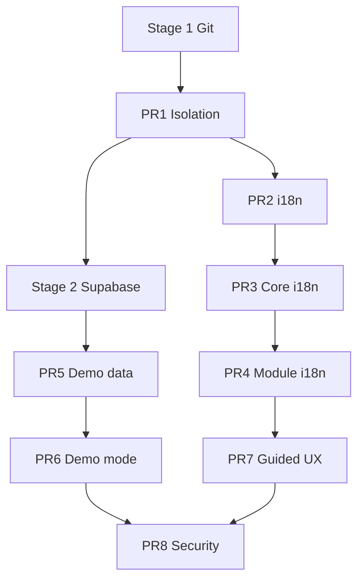

# SPIORA Implementation Plan — Phase A

**Date:** 2026-07-10  
**Product:** Spiora — Corporate Digital Workspace  
**Baseline:** `sharp-spice-team-platform` @ `main` (copy in `spiora demo` folder)

---

## Executive summary

Phase A audit shows the copy is **not isolated**: git remote points to production repo, `.env.local` contains live Supabase/Google/OpenRouter/LiveKit credentials, and source code embeds real team emails. **Do not run dev server or push** until Stages 1–2 complete.

Estimated total effort: **~55–70 developer-days** (1 FTE ≈ 11–14 weeks; parallel work on i18n + demo data ≈ 8–10 weeks with 2 devs).

---

## Phase A deliverables (this document set)

| Document | Purpose |
|----------|---------|
| `SPIORA_ISOLATION_AUDIT.md` | Production linkage, env risk, safe-to-start verdict |
| `SPIORA_I18N_ARCHITECTURE.md` | Locale strategy, next-intl, string inventory |
| `SPIORA_DEMO_DATA_PLAN.md` | Northstar Mobility seed spec |
| `SPIORA_IMPLEMENTATION_PLAN.md` | PR breakdown, timeline, acceptance |

**Phase A rules honored:** no code/env/git remote changes, no commit/push/deploy.

---

## Stage roadmap

```mermaid
flowchart LR
  A[Phase A Audit] --> B[Stage 1 Git]
  B --> C[Stage 2 Infra]
  C --> D[Stage 3 Brand]
  D --> E[Stage 4 i18n]
  E --> F[Stage 5 Demo Data]
  F --> G[Stage 6 Demo Mode]
  G --> H[Stage 7 Demo Auth]
  H --> I[Stage 8 Security Audit]
  I --> J[Stage 9 Sales UX]
  J --> K[Stage 10 Tests]
  K --> L[Stage 11 Release]
```



---

## PR breakdown (minimum 8 PRs)

### PR #1 — Isolation and branding

| Field | Detail |
|-------|--------|
| **Scope** | Git detach, `spiora-demo` repo init commit, `SPIORA_DEMO_MODE` guard skeleton, production URL rejection, `src/config/branding.ts`, rename package to `spiora-demo`, remove Sharp & Spice from metadata/manifest/logo |
| **Key files** | `package.json`, `src/lib/brand.ts` → `src/config/branding.ts`, `src/app/layout.tsx`, `public/manifest.json`, `src/components/ui/Logo.tsx`, `src/lib/supabase/config.ts`, new `src/lib/demo/guards.ts`, `.env.example` (Spiora template, no prod IDs) |
| **Risks** | Accidental push to old remote if Stage 1 skipped; missing guard allows prod Supabase |
| **Tests** | `guards.test.ts`: reject prod URL when demo mode; accept demo ref |
| **Acceptance** | New git remote only; `npm run build` passes; no Sharp & Spice in browser tab; guard crashes dev if prod Supabase URL |
| **SAFE TO COMMIT** | All except any `.env.local`, credentials, real emails |
| **NOT SAFE TO COMMIT** | `.env.local`, Google private keys, production spreadsheet IDs, old team emails |

---

### PR #2 — i18n foundation

| Field | Detail |
|-------|--------|
| **Scope** | next-intl setup, cookie persistence, EN default, `en.json`/`ru.json` scaffold, language switcher (login + header), format helpers |
| **Key files** | `src/i18n/**`, `middleware.ts`, `src/app/layout.tsx`, `src/components/i18n/LanguageSwitcher.tsx`, `src/lib/auth/permissions.ts` (nav keys) |
| **Risks** | Middleware conflict with auth; RSC/client boundary errors |
| **Tests** | Locale default, switch, persistence, fallback, date format |
| **Acceptance** | EN default; RU switch without navigation loss; cookie survives reload |
| **SAFE TO COMMIT** | Yes |
| **NOT SAFE** | N/A |

---

### PR #3 — Core interface translation

| Field | Detail |
|-------|--------|
| **Scope** | Dashboard, auth, shared layout, notifications, settings, errors, toasts, empty states |
| **Key files** | `src/components/dashboard/*`, `layout/*`, `notifications/*`, `auth/*`, `settings/*`, `src/lib/notifications/*`, API error strings |
| **Risks** | Large diff; missed strings |
| **Tests** | Snapshot key coverage; notification translation |
| **Acceptance** | Core flows usable in EN and RU |
| **SAFE TO COMMIT** | Yes |

---

### PR #4 — Module translations

| Field | Detail |
|-------|--------|
| **Scope** | CRM, client card, tasks, calendar, chat, KB, analytics, team, AI UI, meetings |
| **Key files** | All `src/components/{clients,tasks,calendar,team-chat,ai-workspace,analytics,team,meet,knowledge-base}/**` |
| **Risks** | Highest string volume; meet/video edge cases |
| **Tests** | Module smoke tests EN/RU |
| **Acceptance** | No user-visible hardcoded RU in translated modules (CI grep optional) |
| **SAFE TO COMMIT** | Yes |

---

### PR #5 — Demo data and demo accounts

| Field | Detail |
|-------|--------|
| **Scope** | Fictional users, `seed-data.ts`, Supabase seed runner, populate all modules, disable Google fallback |
| **Key files** | `src/lib/demo/**`, `src/lib/auth/users.ts`, `supabase/seed/*`, `google-sheets/service.ts` demo branch |
| **Risks** | Residual prod data in Supabase if wrong project; duplicate seed |
| **Tests** | Seed idempotent; no real emails; client count ≥ 20 |
| **Acceptance** | Fresh Spiora DB + seed → full UI; fictional PII only |
| **SAFE TO COMMIT** | Yes (no passwords in repo) |
| **NOT SAFE** | Real credentials; production Supabase connection during seed script |

---

### PR #6 — Demo mode safeguards

| Field | Detail |
|-------|--------|
| **Scope** | `SPIORA_DEMO_MODE=true` behavior, reset endpoint, integration kills, AI limits, upload restrictions, demo badge |
| **Key files** | `src/lib/demo/**`, API middleware guards, `crm write`, webhooks, cron disable |
| **Risks** | Incomplete guard leaves webhook/cron open |
| **Tests** | Production URL rejected; Google disabled; reset scope |
| **Acceptance** | Public demo cannot hit prod services; owner can reset |
| **SAFE TO COMMIT** | Yes |
| **NOT SAFE** | Hardcoded bypass secrets |

---

### PR #7 — Guided demo UX

| Field | Detail |
|-------|--------|
| **Scope** | Welcome screen, role picker, guided tour, demo tips, prepared AI prompts, CTA form |
| **Key files** | New `src/app/(demo)/welcome` or login flow, tour component, `ai-responses.ts` |
| **Risks** | Scope creep on marketing copy |
| **Tests** | Tour steps render EN/RU |
| **Acceptance** | First-time visitor can explore with guidance |
| **SAFE TO COMMIT** | Yes |

---

### PR #8 — Security audit and release

| Field | Detail |
|-------|--------|
| **Scope** | `SPIORA_DEMO_SECURITY_AUDIT.md`, RLS review, API auth audit, smoke tests, release checklist |
| **Key files** | Docs, `supabase/migrations` RLS policies, rate limit middleware |
| **Risks** | Hostile public demo API abuse |
| **Tests** | Full `npm test`, `npm run build`, RBAC matrix |
| **Acceptance** | Security audit signed off; deploy checklist complete |
| **SAFE TO COMMIT** | Yes (no secrets in audit doc) |
| **NOT SAFE** | Publishing service role keys; enabling prod cron |

---

## Stage 1 checklist (next action after user approval)

1. `git remote remove origin`  
2. `git remote add origin <new-spiora-demo-url>` (or none until repo created)  
3. Verify `git remote -v` — no Sharp-Spice-Team-Platform  
4. Run `npm test` + `npm run build` on unmodified baseline  
5. Commit: `Initialize Spiora demo from platform baseline`  
6. **Do not push** without explicit permission  

---

## Timeline estimate

Assumes 1 senior full-stack dev, part-time review:

| Stage / PR | Duration | Cumulative |
|------------|----------|------------|
| Phase A (done) | 1 day | 1 d |
| Stage 1 Git | 0.5 day | 1.5 d |
| PR #1 Isolation + brand | 3–4 days | 5 d |
| PR #2 i18n foundation | 3–4 days | 9 d |
| PR #3 Core translation | 4–5 days | 14 d |
| PR #4 Module translation | 6–8 days | 22 d |
| Stage 2 Supabase setup | 2 days (parallel) | — |
| PR #5 Demo data | 10–12 days | 34 d |
| PR #6 Demo safeguards | 5–6 days | 40 d |
| PR #7 Guided UX | 4–5 days | 45 d |
| PR #8 Security + release | 5–7 days | 52 d |
| Stage 10 extra tests | 3–4 days | 56 d |

**Total:** ~**8–11 weeks** (1 dev) or ~**6–8 weeks** (2 devs with parallel i18n + infra).

---

## Dependencies



---

## Quick reference — audit highlights

### Git remote (current)

```
origin  https://github.com/Nikigo1983/Sharp-Spice-Team-Platform.git (fetch)
origin  https://github.com/Nikigo1983/Sharp-Spice-Team-Platform.git (push)
Branch: main
```

### ENV: production-related (present in `.env.local`)

- Platform Supabase URL + service role  
- Emigrant Supabase URL + keys  
- Google service account + spreadsheet + Drive folder  
- OpenRouter API key  
- LiveKit URL + API key + secret  
- Team auth passwords  

### Integrations to disable

Supabase (prod), Emigrant Desk, Google Sheets/Drive, production OpenRouter, production LiveKit, GitHub cron → production Vercel, CRM write, diagnostic routes (or owner-only).

### i18n recommendation

**next-intl** with cookie-based locale (no URL prefix initially). Default **English**. ~**700–950** UI keys + ~**150–250** API messages.

### Translation volume

~**7,012** Cyrillic tokens across **229** files; ~**2,400** in UI layers (components + app).

---

## Definition of done (Spiora demo v1)

- [ ] Independent git repo `spiora-demo`, no push path to Sharp-Spice-Team-Platform  
- [ ] Dedicated Supabase project with demo seed only  
- [ ] `SPIORA_DEMO_MODE=true` blocks all production integrations  
- [ ] Brand fully Spiora; no Sharp & Spice in UI  
- [ ] EN default + RU switch with persistence  
- [ ] Fictional Northstar Mobility data in all modules  
- [ ] Demo auth (Owner/Manager) without secrets in source  
- [ ] Reset demo data works for owner  
- [ ] Security audit document complete  
- [ ] `npm test` + `npm run build` green  
- [ ] Smoke tests EN/RU, owner/manager, desktop/mobile documented  

---

## Stop point

**Phase A is complete.** Awaiting user confirmation before **Stage 1 (Git isolation)** or any code changes.
